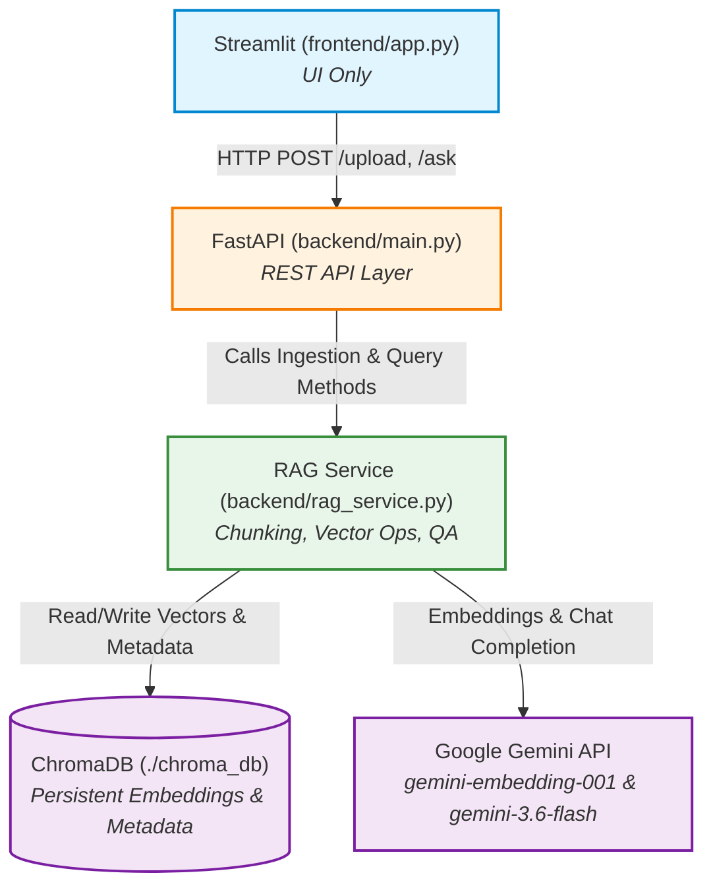

# DocuChat: RAG-Based Document Assistant — Project Plan

---

## 1. Project Summary and Scope

### 1.1 Overview
**DocuChat** is a production-grade, retrieval-augmented generation (RAG) web application that enables users to upload PDF documents and interact with them using natural language. The system is engineered to answer questions **strictly based on uploaded content**, cite exact file names and page numbers for every claim, and return an explicit *"I don't know"* when the requested information is absent.

### 1.2 Core Philosophy
- **Clean Decoupled Architecture**: Presentation (Streamlit) -> HTTP -> Application (FastAPI) -> RAG Service -> ChromaDB & Google Gemini.
- **Interview-Ready Simplicity**: Minimalist, clean, and idiomatic Python design avoiding unnecessary abstractions so every component can be clearly explained in technical interviews.
- **Strict Grounding**: Zero tolerance for ungrounded hallucinations; prompt engineering enforced with temperature `0.0`.

### 1.3 Scope Matrix
| Capability | MVP Scope | Planned for Later (Post-MVP) |
| :--- | :--- | :--- |
| **Document Ingestion** | Single PDF upload (max 20 MB, text-based) | Multi-file batch upload, Word/TXT/Markdown support |
| **Parsing & Chunking** | `pypdf` via LangChain `PyPDFLoader` + `RecursiveCharacterTextSplitter` | OCR for scanned PDFs (`pytesseract` / Document AI) |
| **Vector Storage** | Persistent local Chroma DB (`./chroma_db`) with metadata | Metadata filtering by date/tags, multi-tenant vector DB |
| **Retrieval & QA** | Top-$K$ semantic similarity ($K=4$), single-turn QA | Re-ranking (Cross-Encoders), HyDE, hybrid search (BM25 + Dense) |
| **Conversation** | Single-turn Q&A with session chat display in UI | Multi-turn conversational memory (chat history summarized in context) |
| **User Interface** | Clean Streamlit UI with file uploader & chat window | Streaming LLM tokens, PDF page viewer with highlighted snippets |
| **Document Management** | SHA-256 duplicate detection on upload | List uploaded documents, delete document from Chroma |
| **Deployment & Ops** | Local standard `venv` execution | Docker containerization, `docker-compose`, Cloud Run / AWS |
| **Evaluation** | Pytest test suite with mocked LLM + manual test cases | RAGAS / TruLens automated RAG evaluation metrics |

---

## 2. Proposed Folder Structure

```text
DocuChat Project/
├── .env.example              # Template of all required environment variables (GOOGLE_API_KEY, etc.)
├── .gitignore                # Prevents committing .env, virtualenvs, chroma_db, and uploads
├── README.md                 # Project setup, running instructions, and architecture overview
├── requirements.txt          # Pinned Python package dependencies (fastapi, streamlit, langchain, langchain-google-genai, chromadb, pypdf)
├── PLAN.md                   # Comprehensive project architecture and execution plan
│
├── backend/                  # FastAPI Application Layer & RAG Engine
│   ├── __init__.py           # Makes backend a Python package
│   ├── config.py             # Pydantic Settings / environment variable configuration
│   ├── schemas.py            # Pydantic request & response data models
│   ├── main.py               # FastAPI entrypoint, CORS configuration, and endpoint routes
│   └── rag_service.py        # Core RAG logic: ingestion, chunking, Chroma store, retrieval & Gemini QA
│
├── frontend/                 # Presentation Layer (UI Only)
│   ├── __init__.py           # Makes frontend a Python package
│   └── app.py                # Streamlit UI: file uploader, chat history display, API client
│
├── tests/                    # Automated Test Suite
│   ├── __init__.py           # Makes tests a Python package
│   ├── conftest.py           # Pytest fixtures and mocked embeddings/LLMs
│   ├── test_rag_service.py   # Unit tests for text chunking, prompt creation, and response parsing
│   ├── test_api.py           # Integration tests for FastAPI endpoints (/health, /upload, /ask)
│   └── test_architecture.py  # Architectural isolation tests (ensures Streamlit has no AI/DB imports)
│
├── uploads/                  # [Git-ignored] Temporary storage for uploaded raw PDF files
└── chroma_db/                # [Git-ignored] Persistent SQLite & vector parquet files from Chroma
```

---

## 3. Components and Responsibilities

> [!IMPORTANT]
> **Strict Architectural Isolation Rule**:
> `frontend/app.py` is a **pure UI client**. It communicates **exclusively via HTTP REST calls** to FastAPI.
> - ❌ **NO direct database access**: Streamlit never accesses `./chroma_db/` or `./uploads/` files on disk.
> - ❌ **NO AI SDK imports**: Streamlit never imports `chromadb`, `langchain`, `google.generativeai`, `langchain_google_genai`, or `openai`.
> - ❌ **NO backend module imports**: Streamlit never imports `backend.rag_service` or runs RAG functions locally.
> - ✅ **HTTP Only**: Streamlit only uses the standard `requests` library to talk to `POST /upload` and `POST /ask`.

```text
                 Streamlit (frontend/app.py)
                     │
                     │ HTTP (requests)
                     ▼
                  FastAPI (backend/main.py)
                     │
                     ▼
                 RAG Service (backend/rag_service.py)
                  /       \
                 /         \
                ▼           ▼
      ChromaDB (./chroma_db)   Google Gemini (Embeddings & LLM)
```



### 3.1 Presentation Layer (`frontend/app.py`)
- **Owns**:
  - Rendering the UI (upload sidebar, file status badge, interactive chat message stream, expandable source citation cards).
  - Managing UI state strictly in Streamlit `st.session_state` (messages history, active document metadata).
  - Communicating exclusively with the backend via `requests` HTTP calls to `http://127.0.0.1:8000`.
  - Presenting human-friendly error messages (e.g., backend offline, file too large, invalid format).
- **Must NOT Do (Zero Direct Access)**:
  - ❌ Never import `langchain`, `chromadb`, `google.generativeai`, `langchain_google_genai`, or `openai`.
  - ❌ Never import or call `backend.rag_service`.
  - ❌ Never read or write `./chroma_db/` or `./uploads/` directories.
  - ❌ Never parse PDF binaries or compute embeddings.
  - ❌ Never contain business, retrieval, or AI prompt logic.

### 3.2 Application Layer (`backend/main.py`, `backend/schemas.py`, `backend/config.py`)
- **Owns**:
  - Exposing REST API endpoints (`GET /health`, `POST /upload`, `POST /ask`).
  - Enforcing request validation (HTTP 400 for non-PDFs, file size > 20 MB, empty questions).
  - Handling HTTP lifecycle, CORS middleware, and standard HTTP error response formatting.
  - Initializing and calling `RAGService` methods.
- **Must NOT Do**:
  - Never perform low-level chunking math or construct raw LLM prompt strings directly inside route functions.
  - Never store session state in global variables.

### 3.3 RAG Engine (`backend/rag_service.py`)
- **Owns**:
  - Parsing PDF pages using `PyPDFLoader` (`pypdf`).
  - Splitting extracted text using `RecursiveCharacterTextSplitter` (800 chars, 100 overlap).
  - Generating and attaching standardized chunk metadata (`source`, `page`, `chunk_id`, `doc_hash`).
  - Interacting with Chroma (`langchain-chroma` / `chromadb`) for vector storage and similarity retrieval ($K=4$).
  - Calling Google Gemini Embeddings (`gemini-embedding-001`) and LLM (`gemini-3.6-flash`, temperature `0.0`).
  - Formatting context blocks and executing grounded question-answering with strict prompt rules.
  - Parsing output to separate the answer from cited sources.
- **Must NOT Do**:
  - Never handle HTTP requests, responses, or Streamlit widgets.

### 3.4 Data & External Services
- **Chroma DB (`./chroma_db`)**: Local vector database holding chunk text, embeddings (from `gemini-embedding-001`), and metadata.
- **Google Gemini API**: External cloud provider for embeddings (`gemini-embedding-001`) and chat generation (`gemini-3.6-flash`).

---

## 4. API Design

### 4.1 Health Check
- **Method & Path**: `GET /health`
- **Description**: Verifies backend server availability and basic configuration status.
- **Request**: None
- **Response (200 OK)**:
```json
{
  "status": "healthy",
  "version": "1.0.0",
  "vector_store_ready": true
}
```

---

### 4.2 Document Upload & Ingestion
- **Method & Path**: `POST /upload`
- **Content-Type**: `multipart/form-data`
- **Request Fields**:
  - `file`: `UploadFile` (Binary PDF stream)
- **Response (200 OK)**:
```json
{
  "status": "success",
  "filename": "annual_report.pdf",
  "total_pages": 12,
  "chunks_created": 38,
  "message": "Document successfully indexed."
}
```
- **Error Cases**:
  - `400 Bad Request`:
    - File extension is not `.pdf` or MIME type is not `application/pdf`.
    - File is empty (0 bytes) or exceeds maximum limit (`20 MB`).
    - PDF contains no extractable text (e.g. scanned image-only PDF).
  - `409 Conflict`: File with identical SHA-256 hash is already indexed.
  - `500 Internal Server Error`: Parsing failure or Google Gemini API authentication/network error.

---

### 4.3 Question & Answering (RAG Query)
- **Method & Path**: `POST /ask`
- **Content-Type**: `application/json`
- **Request Body (`QueryRequest`)**:
```json
{
  "question": "What was the company's Q3 revenue growth?"
}
```
- **Response (200 OK) (`QueryResponse`)**:
```json
{
  "answer": "The company's Q3 revenue grew by 14.5% year-over-year.",
  "sources": [
    {
      "file": "annual_report.pdf",
      "page": 4
    },
    {
      "file": "annual_report.pdf",
      "page": 5
    }
  ]
}
```
- **Fallback Response when Information is Absent (200 OK)**:
```json
{
  "answer": "I don't know based on the provided documents.",
  "sources": []
}
```
- **Error Cases**:
  - `400 Bad Request`:
    - `question` is empty or only whitespace.
    - No documents have been uploaded yet (vector store is empty).
  - `500 Internal Server Error`: Google Gemini API rate limit exceeded or connection timeout.

---

## 5. Step-by-Step Data Flow

### 5.1 Flow A: Document Upload & Indexing
```text
[1. User selects PDF in Streamlit]
        │
        ▼ (HTTP multipart/form-data)
[2. Streamlit sends POST /upload to FastAPI]
        │
        ▼
[3. FastAPI validates MIME type, size <= 20MB, reads bytes, computes SHA-256 hash]
        │
        ▼
[4. Saves temporary PDF to ./uploads/ -> PyPDFLoader extracts text & page numbers]
        │
        ▼ (If total characters == 0, raises 400 "Scanned PDF / No text")
        │
        ▼
[5. RecursiveCharacterTextSplitter splits text into ~800 char chunks (100 overlap)]
        │
        ▼
[6. Metadata attached to each chunk: source, page (1-indexed), chunk_id, doc_hash]
        │
        ▼
[7. RAGService calls Google Gemini gemini-embedding-001 to generate embeddings]
        │
        ▼
[8. Vectors + text + metadata persisted in Chroma DB -> JSON response returned to Streamlit]
```

---

### 5.2 Flow B: Question Answering (RAG)
```text
[1. User enters question in Streamlit chat input]
        │
        ▼ (HTTP JSON payload)
[2. Streamlit sends POST /ask {"question": "..."} to FastAPI]
        │
        ▼
[3. FastAPI validates non-empty question and invokes RAGService]
        │
        ▼
[4. RAGService embeds question with Google Gemini gemini-embedding-001]
        │
        ▼
[5. Chroma DB performs similarity search and returns Top-4 chunks + metadata]
        │
        ▼
[6. Prompt constructed with strict system instructions + Context + User Question]
        │
        ▼
[7. Google Gemini (gemini-3.6-flash) generates grounded answer (temperature=0.0)]
        │
        ▼
[8. Backend parses response, deduplicates source citations, and sends JSON back to Streamlit]
```

---

## 6. Chroma Vector Storage & Duplicate Handling

### 6.1 Collection Design
- **Collection Name**: `docuchat_docs`
- **Distance Metric**: `cosine`
- **Storage Location**: Local directory `./chroma_db/` (configured by `CHROMA_DIR`)

### 6.2 Chunk Metadata Schema
Every chunk stored in Chroma will contain the following structured metadata fields:

| Field Name | Data Type | Example Value | Purpose |
| :--- | :--- | :--- | :--- |
| `source` | `str` | `annual_report.pdf` | Displaying cited file name to user |
| `page` | `int` | `3` | Displaying 1-indexed page number |
| `chunk_id` | `str` | `annual_report.pdf_p3_c1` | Unique chunk identifier |
| `doc_hash` | `str` | `a3f5c9e2...` | SHA-256 hash of raw PDF for duplicate checks |

### 6.3 Duplicate Upload Strategy
1. **Hash Calculation**: Upon upload, the backend computes the SHA-256 hash of the incoming byte buffer.
2. **Detection**: The backend queries Chroma metadata for any existing chunk containing `doc_hash == calculated_hash`.
3. **Behavior**:
   - **MVP**: If the document hash is already present, the backend returns HTTP 409 Conflict with message `"Document is already indexed"`, preventing duplicate embeddings and wasted API calls.
   - **Post-MVP**: Provide options to overwrite or re-index.

---

## 7. Configuration & Environment Variables

### 7.1 Environment Variables (`.env`)
```env
# ==========================================
# Google Gemini API Credentials (from Google AI Studio)
# ==========================================
GOOGLE_API_KEY=

# ==========================================
# Model Settings
# ==========================================
LLM_MODEL=gemini-3.6-flash
EMBEDDING_MODEL=gemini-embedding-001

# ==========================================
# RAG Ingestion & Retrieval Hyperparameters
# ==========================================
CHUNK_SIZE=800
CHUNK_OVERLAP=100
TOP_K=4
MAX_UPLOAD_MB=20

# ==========================================
# Storage Paths
# ==========================================
UPLOAD_DIR=uploads
CHROMA_DIR=chroma_db
```

---

## 8. Task Breakdown (Phase-by-Phase)

### Phase 1: Environment & Project Foundation
#### Task 1: Initialize Project Configuration & Dependencies
- **Goal**: Create baseline environment files, dependency manifests, and `.gitignore`.
- **Files Touched**: `requirements.txt`, `.env.example`, `.gitignore`, `README.md`
- **Done When**:
  1. Running `python -m venv venv` and `pip install -r requirements.txt` succeeds without version conflicts.
  2. Git status ignores `.env`, `uploads/`, and `chroma_db/`.

#### Task 2: Backend Settings & Pydantic Data Contracts
- **Goal**: Build centralized configuration loader and Pydantic models for request/response validation.
- **Files Touched**: `backend/config.py`, `backend/schemas.py`
- **Done When**: Running `python -c "from backend.config import get_settings; print(get_settings().LLM_MODEL)"` prints `gemini-3.6-flash`.

---

### Phase 2: RAG Service Engine
#### Task 3: PDF Document Ingestion & Chunking Logic
- **Goal**: Implement PDF text extraction using `PyPDFLoader` and splitting with `RecursiveCharacterTextSplitter`, rejecting empty/scanned PDFs.
- **Files Touched**: `backend/rag_service.py`
- **Done When**: Unit test successfully loads a sample 2-page PDF, produces chunks of $\le 800$ characters, and assigns correct 1-indexed page numbers.

#### Task 4: Vector Store Ingestion & Chroma Persistence
- **Goal**: Integrate Google Gemini embeddings (`gemini-embedding-001`) with Chroma vector store and implement SHA-256 duplicate checking.
- **Files Touched**: `backend/rag_service.py`
- **Done When**: Uploading a PDF writes vector files to `./chroma_db`, and querying Chroma directly by metadata returns chunk records.

#### Task 5: Retrieval & Grounded Generation Pipeline
- **Goal**: Implement Top-4 similarity search, strict grounding prompt template, and Google Gemini LLM call (`gemini-3.6-flash`, temperature 0.0) with source formatting.
- **Files Touched**: `backend/rag_service.py`
- **Done When**: Asking a question present in the document returns the correct answer with page citations; asking an irrelevant question returns `"I don't know based on the provided documents."`.

---

### Phase 3: FastAPI Backend API Layer
#### Task 6: FastAPI Application & Endpoints Setup
- **Goal**: Build FastAPI app instance, CORS middleware, `/health`, `/upload`, and `/ask` endpoints connecting to `RAGService`.
- **Files Touched**: `backend/main.py`
- **Done When**: `uvicorn backend.main:app --reload` starts cleanly and `GET http://127.0.0.1:8000/health` returns `{"status": "healthy"}`.

#### Task 7: API Validation & Error Handling
- **Goal**: Implement robust error responses for file size $>20$ MB, non-PDF file formats, scanned/empty PDFs, and empty questions.
- **Files Touched**: `backend/main.py`
- **Done When**: Uploading a `.txt` file returns HTTP 400 with a clean JSON error message.

---

### Phase 4: Streamlit Presentation Layer
#### Task 8: Streamlit UI Layout & State Management
- **Goal**: Build modern Streamlit layout with upload sidebar, upload progress bar, and chat window using `st.chat_message`.
- **Files Touched**: `frontend/app.py`
- **Done When**: Running `streamlit run frontend/app.py` displays the title, upload sidebar, and chat container.

#### Task 9: Streamlit-Backend API Integration & Source Badges
- **Goal**: Connect Streamlit upload and chat inputs to FastAPI endpoints via `requests`, displaying answers and collapsible source citation expanders (`📄 file_name, Page X`).
- **Files Touched**: `frontend/app.py`
- **Done When**: Uploading a PDF via Streamlit enables asking questions and renders the assistant response with clickable source cards.

---

### Phase 5: Testing & Quality Assurance
#### Task 10: Automated Pytest Suite & Manual Verification
- **Goal**: Implement unit tests for RAG components, architecture isolation tests, and integration tests for FastAPI routes using mocked Gemini API responses.
- **Files Touched**: `tests/conftest.py`, `tests/test_rag_service.py`, `tests/test_api.py`, `tests/test_architecture.py`
- **Done When**: Running `pytest` executes all test cases with 100% pass rate.

---

## 9. Testing Plan

### 9.1 Automated Tests (`pytest`)
- **Unit Tests (`tests/test_rag_service.py`)**:
  - `test_pdf_chunking_metadata`: Ensures `page` numbers are 1-indexed and `chunk_id` is unique.
  - `test_empty_pdf_rejection`: Asserts that an empty/scanned PDF raises a custom `EmptyDocumentError`.
  - `test_grounding_prompt_template`: Asserts context and question are properly injected into the prompt.
  - `test_answer_parser_citations`: Validates separation of generated text and deduplicated source references.
- **Architecture Boundary Tests (`tests/test_architecture.py`)**:
  - `test_frontend_has_no_direct_ai_or_db_imports`: Programmatically scans `frontend/app.py` AST to assert zero imports of `chromadb`, `langchain`, `google.generativeai`, `langchain_google_genai`, `openai`, or `backend.rag_service`.
  - `test_frontend_only_communicates_via_http`: Verifies that Streamlit only uses `requests` to communicate across the network boundary.
- **API Integration Tests (`tests/test_api.py` via FastAPI `TestClient`)**:
  - `test_health_check`: Validates `GET /health` returns status 200.
  - `test_upload_invalid_mime_type`: Uploading a `.jpg` or `.txt` returns HTTP 400.
  - `test_upload_file_exceeds_limit`: Uploading $>20$ MB file returns HTTP 400.
  - `test_ask_empty_question`: Sending `{"question": ""}` returns HTTP 400.
  - `test_ask_with_mocked_llm`: Mocks Gemini call to verify full end-to-end response schema.

### 9.2 Manual Verification Matrix
| Test Scenario | Action | Expected Outcome |
| :--- | :--- | :--- |
| **Normal QA** | Upload a multi-page PDF, ask a direct question | Accurate answer + accurate `file_name` & `page` citation |
| **Out-of-Scope QA** | Ask "What is the recipe for chocolate cake?" | "I don't know based on the provided documents." + no citations |
| **Large File Rejection** | Upload a 25 MB PDF file | Red UI error: "File exceeds maximum size limit of 20 MB" |
| **Scanned PDF Rejection** | Upload an image-only scanned PDF | Red UI error: "Unable to extract text. Please ensure PDF is text-searchable." |
| **Duplicate Upload** | Upload the identical PDF file twice | Yellow warning: "Document already indexed." |
| **Server Offline** | Stop FastAPI and send a question in Streamlit | Friendly UI error: "Unable to connect to backend server." |

---

## 10. Risks and Mitigations

| Risk | Impact | Mitigation Strategy |
| :--- | :--- | :--- |
| **LLM Hallucination** | High | 1. Enforce temperature `0.0`.<br>2. Strict prompt constraint: *"Answer strictly and only from the provided context. If the answer cannot be found in the context, output exactly: I don't know based on the provided documents."* |
| **Scanned / Non-extractable PDFs** | Medium | Compute total extracted character count after `PyPDFLoader`. If count is 0, reject immediately with HTTP 400 explaining that OCR is required. |
| **Gemini API Rate Limits / Cost** | Medium | 1. Use `gemini-3.6-flash` (cost-effective with high rate limits).<br>2. Local Chroma caching prevents redundant embeddings.<br>3. Enforce 20 MB upload cap. |
| **Chroma Database Locking (Windows)** | Low | Instantiate a singleton persistent Chroma client in `rag_service.py` to prevent multi-process SQLite write lock contention. |
| **Loss of Source Attribution** | Medium | Explicitly pass `source` and `page` metadata alongside text chunks into the prompt context markers (e.g., `[Doc: filename.pdf, Page: 2]`). |

---

## 11. Assumptions and Open Questions

### 11.1 Assumptions
1. **Python Version**: Python 3.10 to 3.14 installed on user's machine.
2. **API Access**: The user has a valid `GOOGLE_API_KEY` from Google AI Studio.
3. **Language**: Uploaded documents and questions are primarily in English.
4. **Single-Tenant Local Usage**: Single user operating on localhost without simultaneous multi-user database write concurrency.

### 11.2 Future Enhancements (Post-MVP Roadmap)
- Multi-document management UI (listing all indexed files with a delete button to purge chunks from Chroma).
- Token-by-token streaming responses in Streamlit using Server-Sent Events (SSE).
- Conversational chat memory with query contextualization for follow-up questions.
- Dockerfile and `docker-compose.yml` for containerized one-click deployment.
